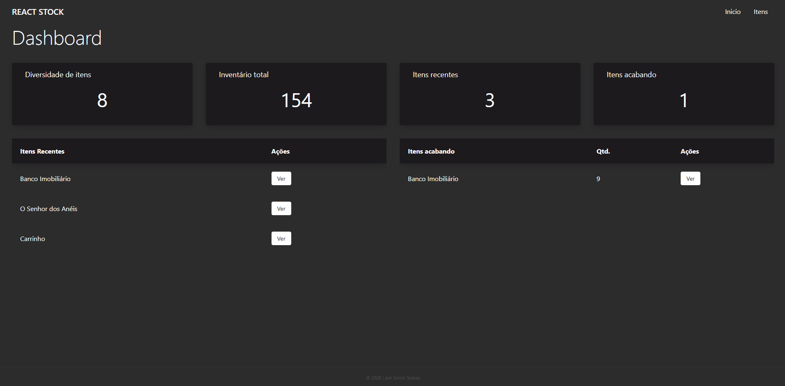
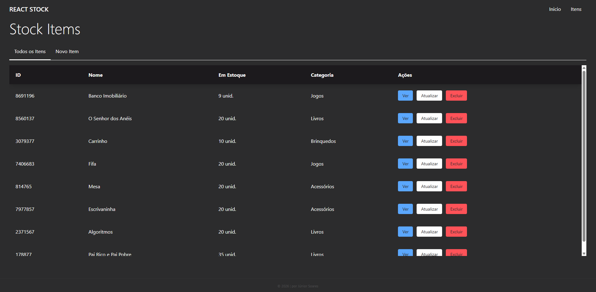
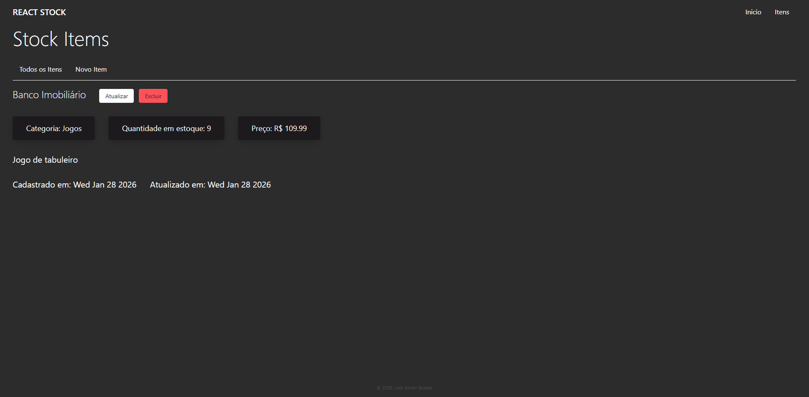

# Controle de Estoque

Este é um projeto de controle de estoque desenvolvido com **React**.  
O objetivo é permitir que usuários registrem produtos, atualizem dados e acompanhem o status do estoque.





---

## Funcionalidades

Sistema que ajuda empresas e pessoas a organizarem seus produtos, evitando falta de mercadorias ou excesso de compras. Ele permite:

- Registrar itens
- Monitorar quantidades
- Atualizar entradas e saídas
- Visualizar o status do estoque

Esse tipo de sistema é muito utilizado no comércio, em e-commerces e até em pequenos negócios.

---

## Tecnologias utilizadas

- **React**
- **JavaScript**
- **CSS**
- **Vite**

---

## Instalação e Execução

### Pré-requisitos

- **Node.js** (versão 14 ou superior)
- **npm** ou **yarn**

### Passos para executar o projeto

1. Clone este repositório:

   ```bash
   git clone https://github.com/JuniorWSoares/Controle-de-Estoque.git
   ```

2. Navegue até o diretório do projeto:

   ```bash
   cd Controle-de-Estoque
   ```

3. Instale as dependências:

   ```bash
   npm install
   ```

   ou

   ```bash
   yarn install
   ```

4. Em outra aba do terminal, execute o projeto em modo de desenvolvimento:

   ```bash
   npm run dev
   ```

   ou

   ```bash
   yarn dev
   ```

5. Acesse a aplicação no navegador:

   ```
   http://localhost:5173
   ```
